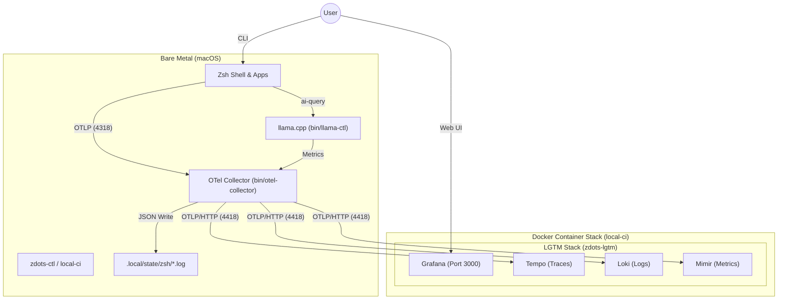
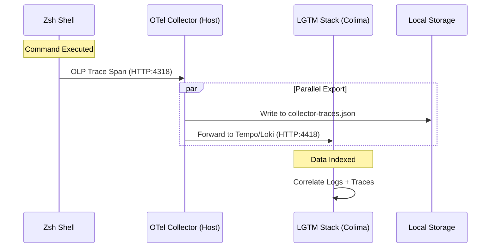
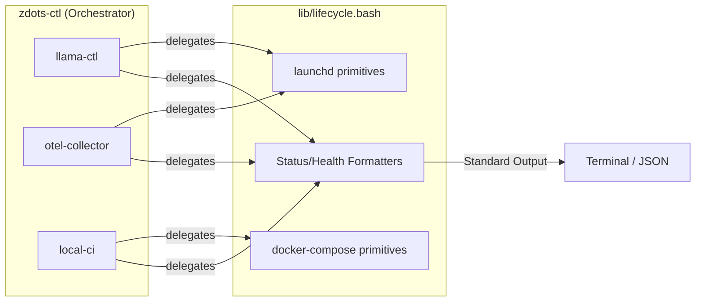

# Zdots: The Deepened Shell Platform

Zdots is more than a Zsh configuration; it is a **Deepened Shell Platform** engineered for local AI development and systemic observability. While traditional dotfiles focus on visual aesthetics and aliases, Zdots provides a high-leverage **Control Plane** for local inference, distributed tracing, and declarative service management.

---

## 1. Core Architectural Pillars

Zdots is built on a "Deepened" architectural philosophy: a small number of semantic interfaces providing massive leverage.

| Pillar | Description | Implementation |
|---|---|---|
| **Local AI SOTA** | High-performance inference via **llama.cpp** and **whisper.cpp**. | `llama-ctl`, `whisper-ctl` |
| **System Observability** | Every shell command emits an OTel span to a local **LGTM** stack. | `bin/otel-collector`, `env.sh` |
| **Declarative Lifecycle** | Services define specs; a unified engine handles registration. | `lib/lifecycle.bash` |
| **Semantic Config** | Centralized Registry resolves derived endpoints from YAML. | `lib/metadata.bash` |
| **Asset Management** | Unified store for downloading and caching AI model assets. | `lib/model-store.bash` |

---

## 2. Why it's "Deep"

Traditional shell configs are **shallow**: a bug in one service's management logic must be fixed everywhere. Zdots is **deep**:

1.  **Opaque Service Seams**: The orchestrator (`zdots-ctl`) interacts with services (AI, OTel, LGTM) only through their CLI grammar. You can swap a background process for a Docker container without changing the orchestrator.
2.  **Locality of Logic**: `launchd` plist generation, HuggingFace model downloads, and endpoint construction are concentrated in core libraries.
3.  **High-Signal Validation**: Includes a 160+ test Bats suite and a high-confidence `secret-scan` to ensure platform integrity on every commit.

---

## 3. The May 2026 AI Stack

Zdots includes a production-grade local AI runtime out of the box:

*   **Inference**: llama.cpp (OpenAI-compatible) using Qwen2.5-Coder and Nomic v2.
*   **Transcription**: whisper.cpp for high-speed local audio-to-text.
*   **Guardrails**: `ai-query` wraps LLM calls in security and normalization layers.
*   **Recipies**: Built-in workflows like `transcribe` (audio → transcript → AI summary).

---

## 4. Architecture Diagrams

### System Overview
The Zdots platform operates as a "Sidecar Control Plane" on the host, delegating heavy observability storage to an isolated container stack.



### Telemetry Signal Flow
Data is captured synchronously by the shell and asynchronously exported/persisted by the collector.



### Unified Service Lifecycle
A shared engine (`lib/lifecycle.bash`) provides a consistent grammar across all service types.



---

## 5. Operational Commands

All components are standalone executables in `bin/`.

| Command | Purpose |
|---|---|
| `zdots-ctl` | Platform orchestrator: `up/down/reset/install/check/status` |
| `llama-ctl` | Manages local LLM lifecycle, profiles, and hardware tuning. |
| `whisper-ctl` | Manages local transcription engine and model management. |
| `ai-query` | Secure, normalized AI inference from any shell context. |
| `otel-collector` | Manages the bare-metal OTel collector and tracing pipeline. |
| `local-ci` | Manages the containerized LGTM (Grafana/Loki/Tempo) stack. |
| `secret-scan` | High-confidence leak detection for AWS, GitHub, and SSH keys. |

---

## 5. High-Value Superpowers

### YouTube Transcription (`ztranscribe`)
A high-performance pipeline for deep context extraction from YouTube videos.

```bash
ztranscribe 'https://www.youtube.com/watch?v=...' --diarize
```

*   **Max Quality**: Extracts best audio (`yt-dlp`) → 16kHz Mono (`ffmpeg`) → `large-v3` (`whisper.cpp`).
*   **Multi-Context**: Generates `.txt`, `.json`, `.srt`, `.vtt`, and `.csv` transcripts simultaneously.
*   **Diarization**: Optional `--diarize` flag identifies "who said what" via `pyannote.audio`.
*   **Hygiene**: Automatically discards heavy media files after processing (override with `--keep-media`).
*   **Metadata**: Captures full video metadata in `.info.json` for RAG and archival.

---

## 6. Setup & Documentation

Refer to [docs/development.md](docs/development.md) for installation.

```sh
make bootstrap          # Full platform installation & model hydration
zdots-ctl status        # Confirm entire stack is green
```

*   [docs/architecture.md](docs/architecture.md) — The DI pattern and loading sequence.
*   [docs/migration.md](docs/migration.md) — How to set up on a new machine.
*   [docs/testing.md](docs/testing.md) — How we ensure the build is always green.
*   [AGENTS.md](AGENTS.md) — Orientation for AI agents (Claude, Gemini) including RTK rules.
