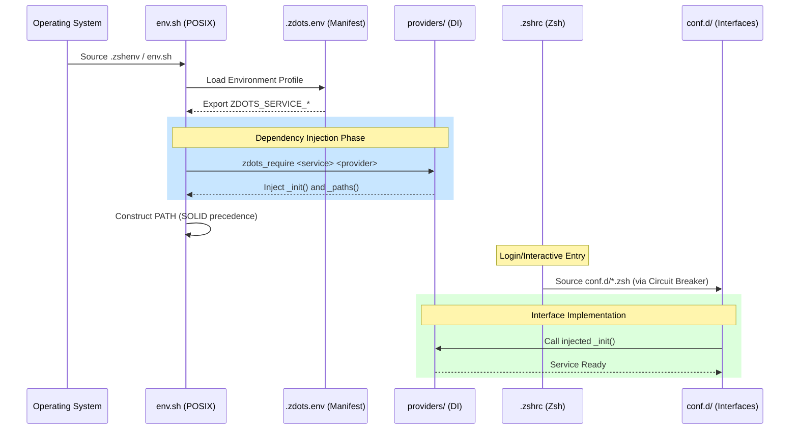

# Zdots: The Observable Control Plane

Zdots is a modular, high-performance Zsh environment built on the principles of **Domain-Driven Design (DDD)** and **SOLID** engineering. It evolves the shell from a collection of scripts into a participating node in a distributed observability system.

---

## 🛠 Shell Loading Sequence

The boot sequence is designed for **Resilience** and **Observability**. Every module is wrapped in a circuit breaker to prevent shell collapse.



---

## ☯️ The Zen of Zsh

Zdots follows a specific philosophy optimized for interactive power and calculated magic.

> *Interactive is better than scripted.*
> *Implicit is better than explicit (for the fingers).*
> *Recursive is better than flat (**/*).*
> *Now is better than never.*

See [docs/zen.md](docs/zen.md) for the full principles.

---

## 🚀 Quick Start

### Installation

```shell
cd
mv -f .zshenv .zshenv.bak
git clone git@github.com:just3ws/zdots.git ~/.config/zsh
ln -s ~/.config/zsh/.zshenv ~/.zshenv
exec "$SHELL"
```

### Bootstrap & Validation

```shell
# Install dependencies
make bootstrap

# Run the health check and regression suite
make check
```

---

## 📊 Core Capabilities

- **Modular Providers**: Swap `homebrew` for `apt` or `mise` for `system` runtimes via `.zdots.env`.
- **Distributed Tracing**: Built-in W3C `traceparent` propagation and OTLP-compatible telemetry.
- **Circuit Breakers**: Isolated module loading ensures the shell remains functional even if a module fails.
- **TDD Native**: Verified by a comprehensive **Bats-core** suite for both POSIX and Zsh contracts.

---

## 📖 Documentation & References

- **[docs/architecture.md](docs/architecture.md)**: Deep dive into the provider pattern and control plane.
- **[docs/zen.md](docs/zen.md)**: Philosophical foundation.
- **[docs/references.md](docs/references.md)**: Zsh manuals, POSIX standards, and XDG specs.
- **[backlog/Backlog.md](backlog/Backlog.md)**: Current tasks and architectural decisions (ADRs).

---

## 🛡 Security

Zdots enforces a strict security baseline including `umask 077` and automatic argument redaction in trace logs. See [SECURITY.md](SECURITY.md) for details.
