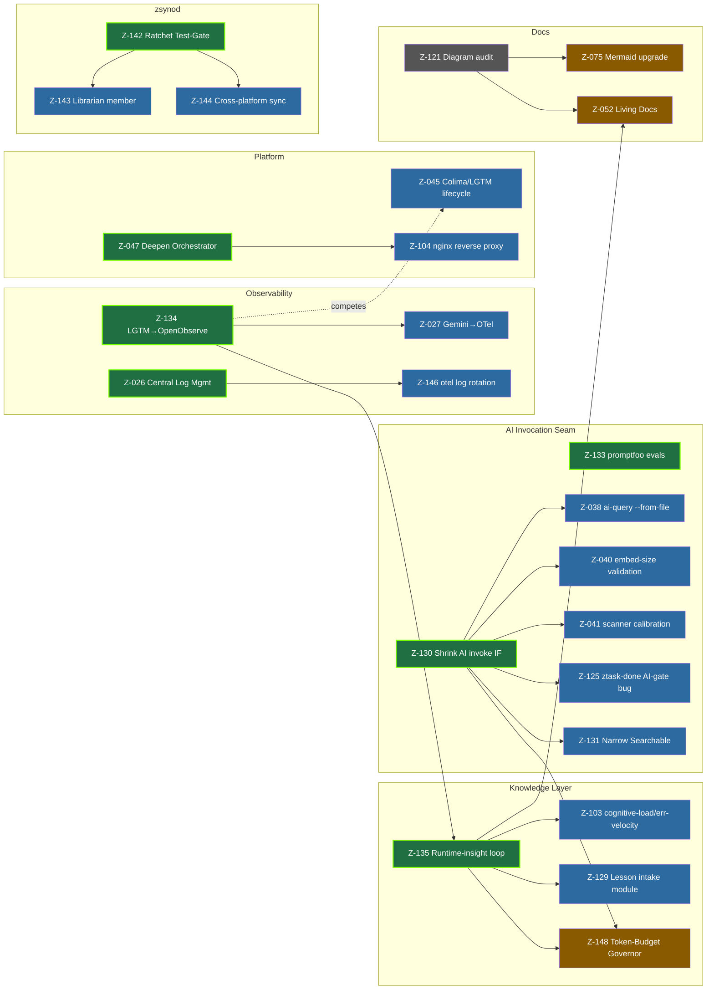

# Backlog Dependency Graph & Leverage Waves

Wave-0 dependency analysis of the open backlog (43 open tasks as of 2026-06-14).
Drives execution priority by **dependency leverage**, not task count or feature
visibility. The mission: *unlock the most future work for the least effort.*

## How to read this (two orthogonal orderings)

| Ordering | Source | Question it answers |
|---|---|---|
| **Sequence** (topological) | `backlog sequence list --plain` (live, computed from edges) | What *can* run now (nothing blocks it)? |
| **Leverage wave** (`wave1..4` labels) | this doc + `backlog task list --labels wave1` | What *should* run first (unlocks the most)? |

They are complementary. The native sequence proves the graph is a **DAG** (it
computes without a cycle error; current critical-path depth = **4**:
`Z-134 → Z-135 → Z-148`). Leverage waves overlay priority *within* the unblocked
set. **Always pick the lowest-wave task among the currently-unblocked (Sequence 1)
tasks.**

## Dependency graph (open tasks)

Arrows point **foundation → unlocked**. Color = leverage wave.



## Leverage ranking (Wave 1 foundations)

`fan_out` = direct unlocks; `transitive` = all downstream open tasks.

| Rank | Task | fan_out | transitive | Effort | Why first |
|---|---|---|---|---|---|
| 1 | **Z-134** OpenObserve migration | 4 | **7** | ~done (1 step) | Observability substrate the entire Knowledge spine reads from. Near-complete → highest unlock-per-effort. **Close it.** |
| 2 | **Z-135** Runtime-insight loop | 4 | 4 | In Progress | The *Infer* step of the Virtuous Loop; unblocks Z-103/Z-129/Z-052/Z-148. Finish it. |
| 3 | **Z-130** Shrink AI invocation IF | **6** | 6 | medium refactor | Highest *direct* fan-out. Establishes the single honest model seam — the one metering point Z-148 needs. Build AI features on this, not the leaky env-var IF. |
| 4 | **Z-142** zsynod Test-Gate | 2 | 2 | medium | Verification foundation before adding zsynod members (Z-143/Z-144). |
| 5 | **Z-026** Central Log Mgmt | 1 | 1 | medium | Subsumes Z-146 (don't build a one-off rotation). |
| 6 | **Z-047** Deepen Orchestrator | 1 | 1 | medium | Platform deepening; enables the nginx service (Z-104). |
| – | **Z-133** promptfoo evals | 0 | 0 | medium | No edge, but the quality gate that validates Z-130's refactor + PHI rules. Wave-1 enabler. |

## Execution waves (leverage-ordered)

- **Wave 0 (this analysis):** edges encoded, labels applied, DAG verified, artifacts cleaned. ✅
- **Wave 1 — shared foundations:** Z-134 (close) · Z-135 (finish) · Z-130 · Z-142 · Z-026 · Z-047 · Z-133.
- **Wave 2 — capability enablers:** Z-038 Z-040 Z-041 Z-125 Z-131 (need Z-130) · Z-103 Z-129 (need Z-135) · Z-027 Z-045 Z-146 · Z-143 Z-144 (need Z-142) · Z-104 (needs Z-047).
- **Wave 3 — dependent features:** Z-148 (needs Z-130+Z-135+Z-134) · Z-052 Z-075 (need Z-121).
- **Wave 4 — polish / independent leaves:** Z-121 · security Z-101 Z-102 · doctor-bug cluster (Z-118 Z-119 Z-126 Z-139 Z-140 Z-141 Z-145 Z-147) · zsynod bugs Z-136 Z-138 · Z-132 Z-093 Z-013 Z-034. Low leverage, high parallelism — safe subagent fan-out anytime.

> Do not start a later wave while a Wave-1 blocker it depends on is open.
> The doctor-bug leaves are wave-independent and may be fanned out in parallel.

## Architectural divergence / duplication flags

Favor **convergence over proliferation** — consolidate, don't add competing impls.

1. **Z-045 ⟂ Z-134 (competing):** Z-045 "Refactor Colima/**LGTM** Lifecycle" — but
   Z-134 *retires* LGTM for OpenObserve. The LGTM half of Z-045 is being deleted.
   **Resolution:** after Z-134 closes, re-scope Z-045 to Colima-lifecycle only (or
   fold it into Z-047 Orchestrator). Edge `Z-045 → Z-134` encoded so it waits.
2. **Z-146 ⊂ Z-026 (subset):** Z-146 (otel log rotation) is one instance of Z-026
   (centralized log management). **Resolution:** make Z-146 the first *consumer* of
   Z-026, not a bespoke rotation. Edge `Z-146 → Z-026` encoded.
3. **Resolved Done-duplicate pairs (informational):** Z-090/Z-100 (App Firewall
   assertion), Z-091/Z-099 (SIP/FileVault assertion), Z-112/Z-113 (zdots-ctl
   line-451 syntax error). Both of each pair are Done — no action, noted to prevent
   re-filing.

## Live commands (the always-fresh source)

```bash
backlog sequence list --plain        # current waves from edges (authoritative)
backlog task list --labels wave1     # this wave's leverage foundations
backlog task list --labels set:ai-seam   # a feature set
backlog overview                     # board stats
backlog browser                      # interactive graph/board
```

This doc is the **rationale snapshot**; `backlog sequence` is the **live truth**.
When task state changes, trust the command, then refresh the ranking here.

## Protocol

Operate through Backlog.md tools — never hand-edit task markdown, never create a
literal `Backlog.md`/`backlog.md` file as a planning surface. See
[docs/backlog.md](../../docs/backlog.md) for the full operating contract.
