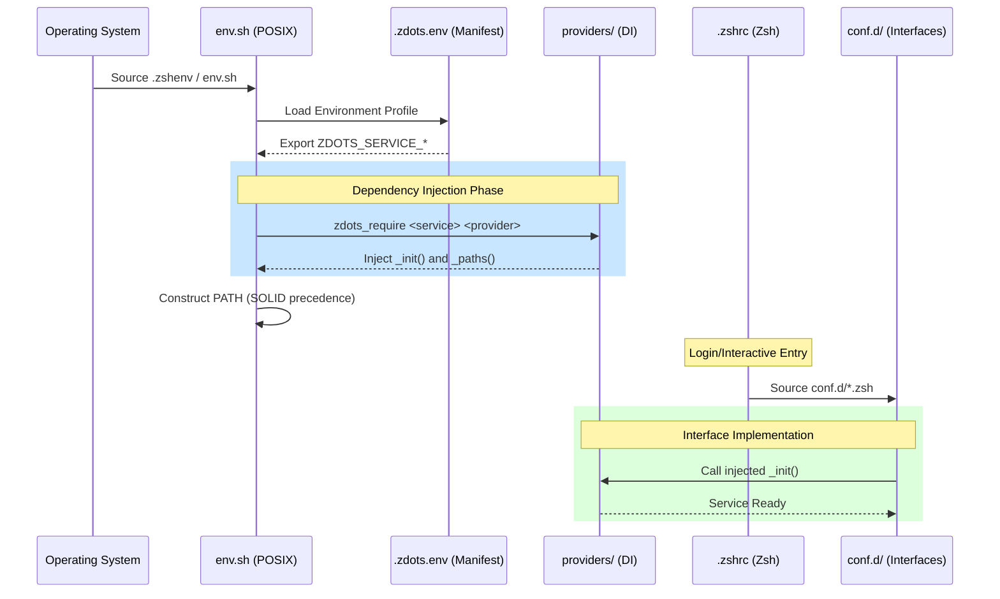
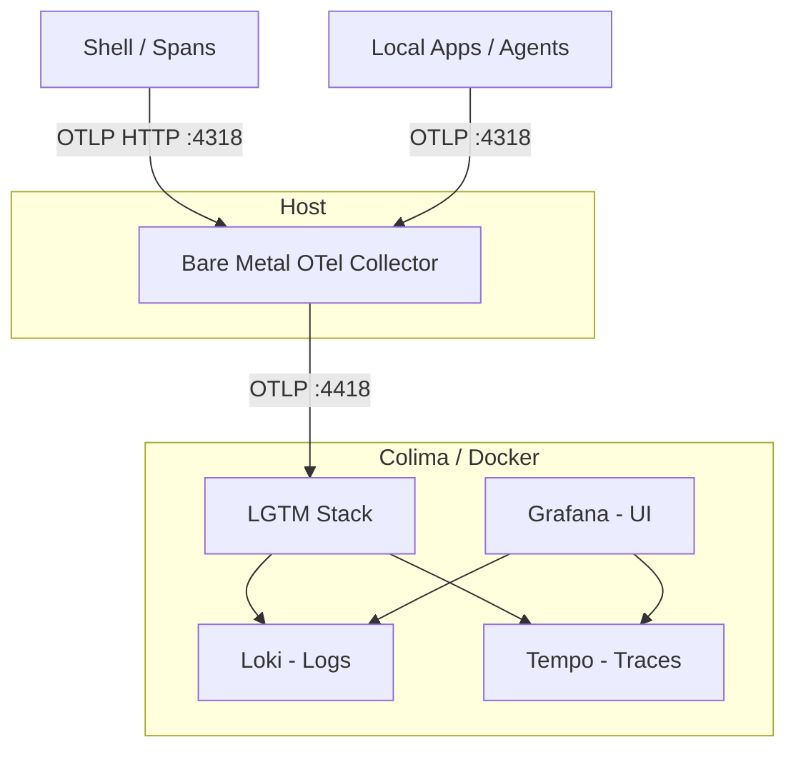
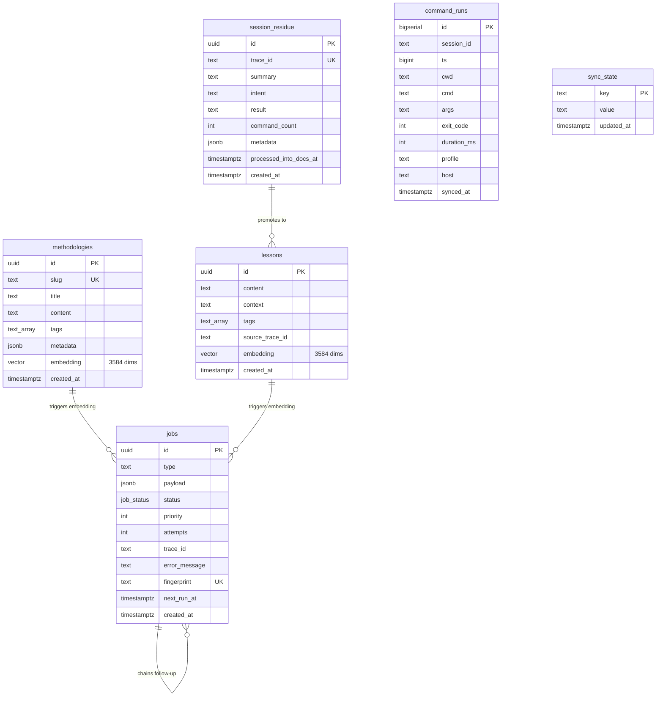
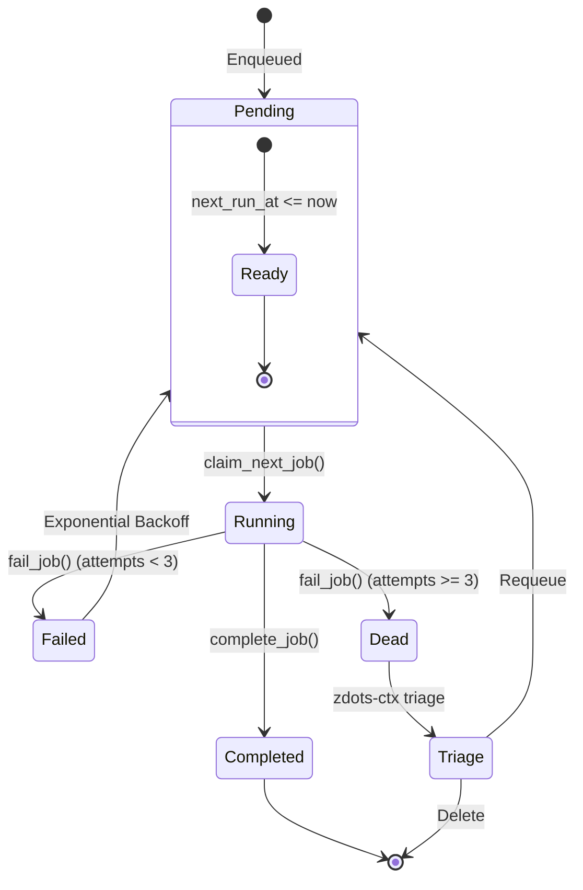
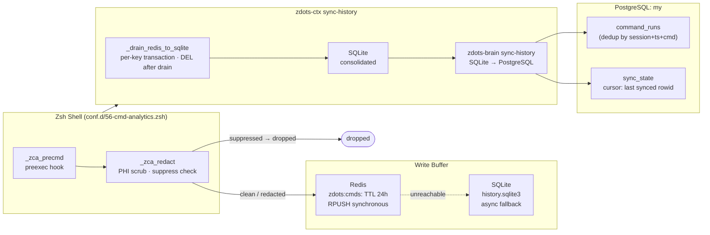
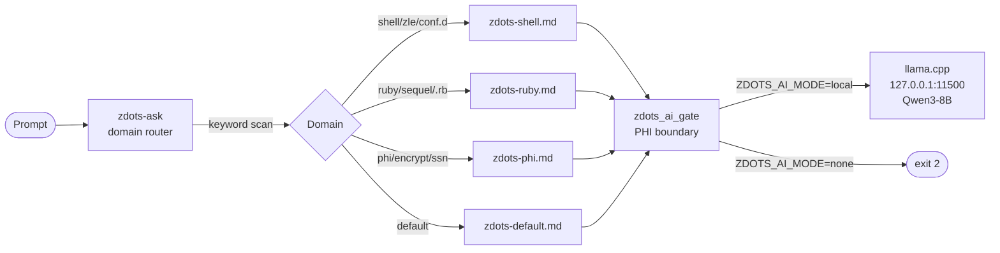

# Zdots Architecture: Modular Control Plane

This document describes the architectural principles, loading sequence, and lifecycle management of the Zdots environment.

## 1. Core Principles

Zdots is designed as an **Observable Control Plane** rather than a static configuration. It applies software engineering best practices to the shell:

- **Domain-Driven Design (DDD)**: Logic is partitioned into "Services" (e.g., Package Management, Node Runtime).
- **Dependency Injection (DI)**: Specific implementations (Providers) are injected at runtime based on the environment.
- **SOLID Principles**: Providers are interchangeable (Liskov Substitution), and core logic depends on abstractions rather than concrete paths (Dependency Inversion).
- **Observability**: Built-in W3C Trace Context propagation and OTLP-compatible telemetry.

---

## 2. Shell Loading Sequence

The following diagram illustrates the boot sequence from the moment a shell process starts.



---

## 3. Environment Provider Pattern

The system uses a **Composition Root** (`.zdots.env`) to map abstract services to concrete providers.

### Profiles
- **`macos-standard`**: Optimized for local development with Homebrew and Mise.
- **`ci-act`**: Minimalist profile for Linux/GHA, avoiding Mac-specific paths and using system runtimes.

### Service Mapping
| Service | Providers | Responsibility |
| :--- | :--- | :--- |
| `PKG_MANAGER` | `homebrew`, `apt`, `none` | Path setup, `brew shellenv`, package caching. |
| `NODE_RUNTIME` | `mise`, `system` | Toolchain shims, version management. |
| `TRACE` | `otlp`, `local`, `none` | Session ID, Span rotation, Telemetry export. |
| `AI` | `llama-cpp`, `remote` | Local inference, log parsing, data reduction. |
| `WHISPER` | `whisper-cpp`, `none` | Local audio transcription and meeting notes. |

---

## 4. Service Interface Contracts

Each service type must implement a standard set of functions to ensure **Liskov Substitution**:

### AI Service Contract
- **`zdots_ai_init()`**: Initializes model metadata and performs a non-blocking health check on the inference server.
- **`zdots_ai_infer(prompt, system_prompt)`**: The primary execution engine. It takes a prompt and optional system context and returns raw text.

---

## 4. Observability Control Plane

Every shell session is a root span in a distributed trace.

1. **Identity**: `ZDOTS_TRACE_ID` (32 hex) is generated at boot.
2. **Context**: `TRACEPARENT` is exported for all child processes (W3C standard).
3. **Instrumentation**:
    - `preexec`: Rotates `ZDOTS_SPAN_ID` for every command.
    - `curl`: Wrapper automatically injects the `traceparent` header.
4. **Export**: The `otlp` provider sends JSONL logs to a local collector asynchronously.

## 5. Hybrid Observability Routing

Zdots implements a tiered telemetry routing system to ensure high performance on the host and centralized storage in the control plane.



1. **Bare Metal Collector (BMC)**: Runs directly on the host. It acts as a high-performance buffer and router. It is the primary "Ground Truth" for local traces.
2. **LGTM Stack**: A bundled observability hub (Loki, Grafana, Tempo, Mimir) running in Colima.
3. **Multi-hop Routing**: BMC forwards all collected spans to the LGTM stack via mapped ports (4417/4418), allowing for long-term storage and advanced visualization in Grafana.

---

## 7. PostgreSQL Intelligence Suite (The Brain)

The platform includes a persistent knowledge store to manage methodologies, lessons, and asynchronous work.

### Database Schema (ER Diagram)
The following diagram illustrates the relational structure of the Shell Brain.



### Job Broker Lifecycle (State Diagram)
Asynchronous tasks transition through the following states, managed by PostgreSQL stored procedures.



### Knowledge Vault Management

The Knowledge Vault (`~/my`) is the local entry point for platform knowledge. It
must be structured consistently across machines for reliable ingestion into the
Brain.

#### Vault Structure

Initialize or verify the structure using the provided utility:

```bash
zdots-my-sync
```

This creates the following directory hierarchy:

```text
~/my/
├── backlog/         # Implementation tickets and tasks
├── lessons/         # Post-mortem insights, solved bugs
├── methodologies/   # Engineering standards, patterns
├── standards/       # Formal platform documentation
├── transcripts/     # Raw transcriptions for ingestion
└── adrs/            # Architecture Decision Records
```

#### Ingestion Workflow

To populate the Brain from the Vault:

1.  **Aggregate**: Place new documents or cleaned transcriptions into the
    appropriate subdirectory (e.g., `standards/` for platform docs,
    `transcripts/` for meeting notes).
2.  **Ingest**: Run the ingestion pipeline to index content for semantic
    querying:

    ```bash
    zdots-ctx ingest ~/my/standards/
    ```

#### Operational Best Practices

*   **Documentation Aggregation**: Treat `standards/` as a living repository.
    Periodically aggregate scattered notes into cohesive `PLATFORM_OWNERSHIP.md`
    or ADR files, then run `zdots-ctx ingest` to refresh the local context.
*   **Transcript Hygiene**: Pi transcripts often contain conversational noise.
    Scrub them of identifiers and noise *before* moving them into `transcripts/`
    for ingestion.
*   **Security Fence**: **Never** ingest files containing API keys, database
    credentials, or sensitive environment variables into your Vault, even for
    local-only ingestion.
*   **The Brain Fence**: Ensure `ZDOTS_DATABASE_URL` is configured for your current
    environment. If moving to a new machine, initialize the platform services
    before attempting `zdots-ctx ingest`.

### Credential rotation (auth boundary)

The `zdots_ro` (SELECT-only) and `zdots_rw` (DML) users are **fences against
accidental writes/deletes**, not a security perimeter — but a fence is worth
having even though it can be hopped. Their passwords are **ephemeral keys** held
in macOS Keychain (service `zdots`, accounts `ZDOTS_RO_PASSWORD` /
`ZDOTS_RW_PASSWORD`) and rotated on demand:

| Command | Purpose |
| :--- | :--- |
| `zdots-ctx rotate-creds --all` | Rotates both `zdots_ro` and `zdots_rw` |
| `zdots-ctx rotate-creds zdots_rw` | Rotates `zdots_rw` only |
| `zdots-ctx rotate-creds zdots_ro` | Rotates `zdots_ro` only |

Each rotation generates a fresh URL-safe key (`openssl rand -hex 24`), applies it
via the superuser migration URL (`ALTER ROLE … PASSWORD`, password passed over
stdin so it never appears in `ps`), and stores it in Keychain atomically.
`bin/zdots-ctx` splices the Keychain password into `ZDOTS_DATABASE_URL` at
startup (`_inject_db_password`), so every downstream `psql`/brain call picks up
the current key from one place. An URL with an explicit password is left
untouched.

**Enforcement (active).** `pg_hba.conf` requires `scram-sha-256` for `zdots_ro` /
`zdots_rw` via user-specific rules placed **above** the catch-all `trust` lines:

```
local   all   zdots_ro,zdots_rw                  scram-sha-256
host    all   zdots_ro,zdots_rw   127.0.0.1/32   scram-sha-256
host    all   zdots_ro,zdots_rw   ::1/128        scram-sha-256
```

A passwordless connection as these users now fails; the OS superuser keeps `trust`
via the catch-all, so migrations (`ZDOTS_MIGRATION_URL`) and `rotate-creds`'
`ALTER ROLE` are unaffected. All app paths inject the Keychain password:
`bin/zdots-ctx` (`_inject_db_password`), the brain (`lib/zdots/db.rb`), and the
context-engine Rails bridge (`zdots_bridge.rb`) all resolve the URL through
`lib/zdots/db_url.rb`. Reload after editing `pg_hba.conf` with
`psql -c "select pg_reload_conf()"` (no restart). A timestamped `pg_hba.conf.bak.*`
backup sits next to the live file.

**Interactive psql.** `psql -U zdots_ro my` now prompts for a password. For
frictionless exploration, supply it from Keychain:

```bash
PGPASSWORD="$(security find-generic-password -s zdots -a ZDOTS_RO_PASSWORD -w)" \
  psql -U zdots_ro my
```

---

## 8. Command Analytics Pipeline

Shell commands flow through a two-stage write path before landing in PostgreSQL.



**PHI contract:** `_zca_redact` runs `phi_should_suppress` first. Suppress-flagged commands (connection strings) set `_ZCA_CMD=""` and return — no write to Redis, SQLite, or PostgreSQL. Redact patterns apply `phi_scrub` (sed substitution) before the write.

`shell_hook_metrics` uses the same SQLite buffer and sync path to capture rare
`phi-history` overhead samples above the warning threshold, so slow hook
branches can be queried alongside command analytics.

---

## 9. Local AI Routing Architecture

The AI layer sits between the operator and llama.cpp, enforcing PHI boundaries and injecting domain-specific system prompts. See [local-ai.md](local-ai.md) for full documentation.

### Routing Flow



### AI Verification Tiers

| Tier | Tool | What it checks | Speed |
|---|---|---|---|
| Structural | `zdots-ctl check` AI router section | Files present, scripts executable, domain detection correct | < 2s |
| Connection | `tests/llama_integration.rb --quick` | llama.cpp responds, chat + embeddings functional | ~10s |
| Capability | `zdots-quiz --quick` | Local model produces correct zdots conventions | ~20s |
| Full baseline | `zdots-quiz` | All 14 domain cases | ~5 min |

---

## 10. CI/CD Lifecycle & Contract Validation

Zdots uses a tiered validation strategy to ensure environmental stability.

### Tier 1: Capability Report (`bin/capabilities`)
The first step in any CI run. It performs **Contract Testing**:
- Verifies that all providers declared in the manifest exist.
- Validates path health and OTel resource attributes.
- Fails fast if the environment does not match its self-description.

### Tier 2: Regression Suite (`bin/check`)
- **Sanity**: Verifies shell options, history modes, and basic tool presence.
- **TDD (Bats-core)**:
    - `tests/env_posix.bats`: Ensures `env.sh` remains POSIX-compliant.
    - `tests/observability.bats`: Validates Span rotation and Traceparent logic.

### Tier 3: Security (`bin/secret-scan`)
- Scans for leaked credentials using high-confidence patterns.
- Includes a CI diagnostic harness for transparent failure reporting.
