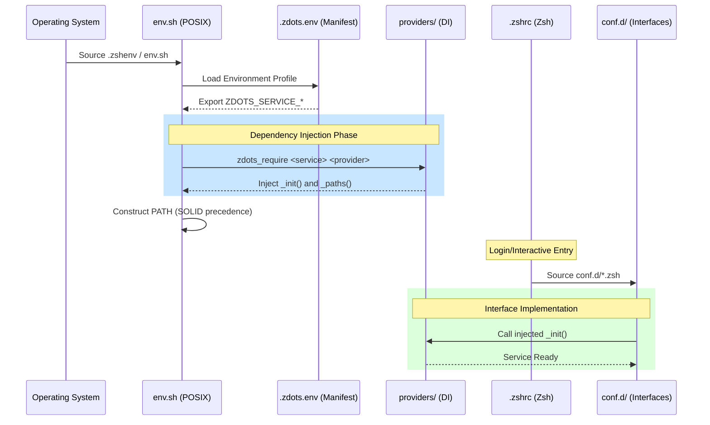

# Zdots Architecture: Modular Control Plane

This document describes the architectural principles, loading sequence, and lifecycle management of the Zdots environment.

## 1. Core Principles

Zdots is designed as an **Observable Control Plane** rather than a static configuration. It applies software engineering best practices to the shell:

- **Domain-Driven Design (DDD)**: Logic is partitioned into "Services" (e.g., Package Management, Node Runtime).
- **Dependency Injection (DI)**: Specific implementations (Providers) are injected at runtime based on the environment.
- **SOLID Principles**: Providers are interchangeable (Liskov Substitution), and core logic depends on abstractions rather than concrete paths (Dependency Inversion).
- **Observability**: Built-in W3C Trace Context propagation and OTLP-compatible telemetry.

---

## 2. Shell Loading Sequence

The following diagram illustrates the boot sequence from the moment a shell process starts.

---

## 3. Environment Provider Pattern

The system uses a **Composition Root** (`.zdots.env`) to map abstract services to concrete providers.

### Profiles
- **`macos-standard`**: Optimized for local development with Homebrew and Mise.
- **`ci-act`**: Minimalist profile for Linux/GHA, avoiding Mac-specific paths and using system runtimes.

### Service Mapping
| Service | Providers | Responsibility |
| :--- | :--- | :--- |
| `PKG_MANAGER` | `homebrew`, `apt`, `none` | Path setup, `brew shellenv`, package caching. |
| `NODE_RUNTIME` | `mise`, `system` | Toolchain shims, version management. |
| `TRACE` | `otlp`, `local`, `none` | Session ID, Span rotation, Telemetry export. |

---

## 4. Observability Control Plane

Every shell session is a root span in a distributed trace.

1. **Identity**: `ZDOTS_TRACE_ID` (32 hex) is generated at boot.
2. **Context**: `TRACEPARENT` is exported for all child processes (W3C standard).
3. **Instrumentation**:
    - `preexec`: Rotates `ZDOTS_SPAN_ID` for every command.
    - `curl`: Wrapper automatically injects the `traceparent` header.
4. **Export**: The `otlp` provider sends JSONL logs to a local collector asynchronously.

---

## 5. CI/CD Lifecycle & Contract Validation

Zdots uses a tiered validation strategy to ensure environmental stability.

### Tier 1: Capability Report (`bin/capabilities`)
The first step in any CI run. It performs **Contract Testing**:
- Verifies that all providers declared in the manifest exist.
- Validates path health and OTel resource attributes.
- Fails fast if the environment does not match its self-description.

### Tier 2: Regression Suite (`bin/check`)
- **Sanity**: Verifies shell options, history modes, and basic tool presence.
- **TDD (Bats-core)**:
    - `tests/env_posix.bats`: Ensures `env.sh` remains POSIX-compliant.
    - `tests/observability.bats`: Validates Span rotation and Traceparent logic.

### Tier 3: Security (`bin/secret-scan`)
- Scans for leaked credentials using high-confidence patterns.
- Includes a CI diagnostic harness for transparent failure reporting.
