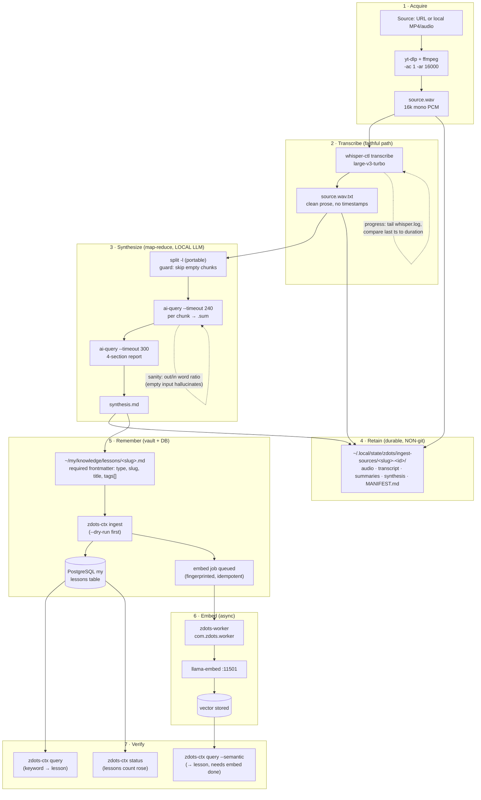

# Ingest-Media Pipeline — actors, interactions, verification

The `/ingest-media` skill turns an audio/video source into a remembered **Lesson**
in the Knowledge Layer, **entirely on-box** (PHI-safe, no cloud tokens). This doc
is the authoritative map of the pipeline: who the actors are, how data flows
between them, where state lives, and how each stage is verified.

Validated end-to-end on 2026-06-17 against
`https://youtu.be/rlbJr6kenS0` ("I Tested EVERY Local AI App to find the BEST",
Percepto, 15:44) — see the [Gap Audit](#gap-audit-2026-06-17) for what that run
fixed.

## Actors

| Actor | Role | On-box? |
|---|---|---|
| **Operator** | The `/ingest-media` skill driving the sequence (agent or human) | — |
| **yt-dlp + ffmpeg** | URL fetch + transcode to 16 kHz mono WAV (whisper-ready) | yes |
| **whisper-ctl** | whisper.cpp (large-v3-turbo) — the *faithful* transcription path | yes |
| **ai-query → llama-server** (`:11500`) | Local LLM, map-reduce synthesis | yes |
| **Retention store** (`~/.local/state/zdots/ingest-sources/`) | Durable, NON-git originals — re-transcription source of truth | yes |
| **Knowledge Vault** (`~/my/knowledge/lessons/`) | Curated Lesson — source of truth for the Knowledge Layer | yes |
| **zdots-ctx / zdots-brain** | Ingest interface — vault file → DB row + embed job | yes |
| **PostgreSQL `my`** (`lessons` table) | DB mirror of the vault | yes |
| **zdots-worker** (`com.zdots.worker`) | Persistent launchd service draining the job queue | yes |
| **llama-embed** (`:11501`) | Embedding model — turns the embed job into a vector | yes |

> **Bot-gated URL sources** (notably YouTube) reject anonymous `yt-dlp` fetches
> with "Sign in to confirm you're not a bot". Supply cookies via the opt-in
> `ZDOTS_YTDLP_COOKIES_FROM_BROWSER` or `ZDOTS_YTDLP_COOKIES_FILE` knobs
> ([configuration.md](configuration.md)); non-gated sources (Vimeo, archive.org)
> need none.

## Dataflow

## State & verification checklist

Each stage produces an inspectable artifact. **Do not advance past a stage with a
failed check** — that is how ambiguity ("did it land?") creeps in.

| Stage | State artifact | Verify | Pass signal |
|---|---|---|---|
| 1 Acquire | `source.wav` | `file source.wav` | `WAVE … mono 16000 Hz` |
| 2 Transcribe | `source.wav.txt` | `wc -w`; `grep -cE '\[[0-9]{2}:' ` | non-trivial words; **0** timestamp lines |
| 3a Map | `chunk_*.sum` | per-chunk in/out word ratio | every chunk has non-empty input AND output |
| 3b Reduce | `synthesis.md` | `grep -c '^## '` | the 4 required sections present |
| 4 Retain | `MANIFEST.md` | `ls` the retention dir | audio + transcript + synthesis + manifest all present |
| 5a Dry-run | stdout | `zdots-ctx ingest --dry-run` | `1 ingested, 0 skipped, 0 errors` |
| 5b Ingest | DB row | `zdots-ctx status` before/after | lessons count **+1** |
| 6 Embed | recall, not job row | poll `zdots-ctx query --semantic` (≤~90s) | lesson returns under `### SEMANTIC MATCHES: LESSONS` — the authoritative drained signal |
| 7 Verify | query stdout | `zdots-ctx query` (keyword) + `--semantic` | keyword hit under lowercase `searching lessons (text)...`; semantic hit under `### SEMANTIC MATCHES: LESSONS` (the two headers differ — don't grep `LESSONS` for keyword) |

The **stage-6 async gap** is the subtle one: `zdots-ctx ingest` only *queues* the
embed job. Semantic recall (stage 7) silently returns nothing until
`zdots-worker` drains it. The authoritative "drained" signal is **semantic recall
returning the lesson** (poll it, ≤~90s) — more reliable than hunting the job row.
If it never lands, the queue is stuck: a prior non-recoverable job (e.g.
`[:phi_suppressed, …]`) can loop and starve yours — check `zdots-ctx jobs`, and
if `zsvc list` shows `zdots-worker` stopped, start it (`zsvc start worker`).

## Gap Audit (2026-06-17)

Findings from the live `rlbJr6kenS0` run, with the fix applied to the skill:

| # | Gap | Severity | Resolution |
|---|---|---|---|
| 1 | `split -n l/3` is **GNU-only** — macOS BSD `split` rejects it ("number of chunks is invalid"), silently producing zero chunks | **breaking** | Skill now uses portable `split -l $(((lines+2)/3))` |
| 2 | `ai-query` on **empty stdin hallucinates** (produced 150 invented words, exit 0) — combined with #1 this fabricates a synthesis from nothing | **breaking** | Skill guards `[[ -s chunk ]]` and sanity-checks out/in word ratio |
| 3 | Semantic recall depends on an **async embed job**; no instruction to confirm it completed or that `zdots-worker` is running | feedback gap | Added stage-6 verification + worker note (above + skill) |
| 4 | Whisper runs **blind** in the background — "run in background" with no progress mechanism | feedback gap | Documented `tail -f whisper.log` + last-timestamp-vs-duration progress signal |
| 5 | ~10 hand-run steps with **copy-pasted slug/id/paths**; no single entrypoint | manual friction | Skill sets `SLUG`/`ID`/`DIR` **once**; a real orchestrator command is filed as a zdots **request** (not built ad-hoc, per AGENTS.md §5) |
| 6 | Query preview showed **provenance boilerplate** instead of the thesis | minor UX | Skill leads the lesson body with a one-line summary; provenance follows |
| 7 | Verification grepped `LESSONS`, silently missing **keyword** hits — keyword uses a lowercase `searching lessons (text)...` header; only *semantic* uses `### SEMANTIC MATCHES: LESSONS` | verification trap | Skill Step 5.4 + stage-7 row now spell out both headers |

### Second confirmation run (2026-06-17, `kft86_LA-Pg`)

OpenObserve OTel-correlation talk (5:07) re-ran the full chain clean: 843-word
transcript (0 timestamps), portable split → 3 chunks, 4-section synthesis,
lessons 2→3, embed drained in ~5s, keyword + semantic recall both hit. All
session-1 hardening held; the only friction was finding #7 above (a grep error in
verification, not a pipeline fault), now documented.

### Remaining manual-intervention points (by design / pending)

- **Operator judgement** on slug, tags, and whether the synthesis is faithful
  enough to keep — this is curation, not automation, and stays manual.
- **A single `zdots-ingest-media <src>` orchestrator** would collapse stages 1–5
  into one observable command with per-stage progress. That is a new zdots
  capability — filed as a request, not patched in by the skill (AGENTS.md §5).
