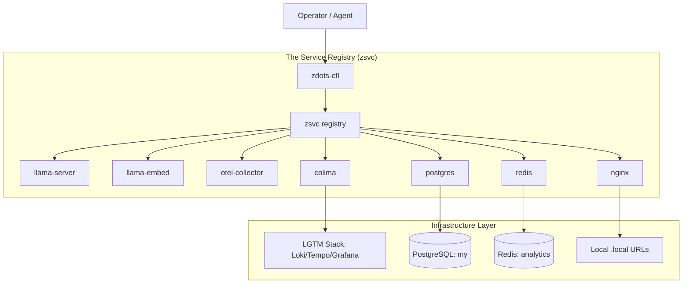

# Project Lifecycle & Learning Guide

This guide covers the full lifecycle of a Zdots contribution, from environment setup to production diagnostics, mapping the myriad services and their inter-dependencies.

---

## 1. Onboarding & Setup (The Beginning)

Zdots is a "platform-in-a-repo." Getting started requires aligning your local environment with the platform's expectations.

### Bootstrap
Run the bootstrap script to install dependencies (Homebrew, Ruby, Node, etc.) and configure the base shell.
```bash
bin/bootstrap
```

### Verification
Ensure the platform is "Green" before doing any work.
```bash
zdots-ctl status
zsvc health
```

---

## 2. The Central Control Plane (zdots-ctl)

`zdots-ctl` is the orchestrator. It manages the **vertical stack** dependencies.

### Vertical Dependency Map


---

## 3. Inter-Service Integrations (The Web)

Services do not live in isolation. They form a web of horizontal dependencies.

| Service | Depends On | Why? |
|---|---|---|
| **zdots-ctx** (Brain) | Postgres | Stores knowledge and methodologies. |
| **zdots-ask** (AI) | llama-server | Performs local inference. |
| **zdots-ask** (Context) | zdots-ctx | Hydrates prompts with brain context. |
| **otel-collector** | local-ci (LGTM) | Exports traces to Tempo/Loki. |
| **zsvc health** | nginx | Probes local routing endpoints. |
| **ztask** | Postgres | Tracks task state and shell history links. |
| **agent-guide** | All Services | Advertises endpoints to AI agents. |

---

## 4. Task Orchestration (The Middle)

Every change in Zdots is tracked via an issue and a task.

### Starting a Task
Use `ztask` to start a new task. This hydrations your environment with the task context and prepares the brain.
```bash
ztask start Z-123 "Fix llama-server timeout"
```

### The Sentient Workbench Cycle
1. **Start Task**: `ztask start`
2. **Consult Brain**: `zdots-ctx query "similar fixes"`
3. **Engage Agent**: `gm` (Gemini) or `zaider` (local Aider)
4. **Commit & Close**: `ztask done`

---

## 5. High-Value Integration Pipelines

Zdots tools are designed to be piped together, crossing service boundaries.

### The "Transcribe & Summarize" Pipeline
Uses `yt-dlp` (Downloader) → `ffmpeg` (Processor) → `whisper.cpp` (Inference) → `zdots-ask` (AI).
```bash
ztranscribe 'https://youtu.be/...' --ai "summarize into 5 bullet points"
```
*   **Vertical**: Depends on `whisper-ctl` for model management.
*   **Horizontal**: Depends on `llama-server` for the final AI summary.

### The "Context Hydration" Pipeline
Uses `zdots-ctx` (Brain) → `zdots-ask` (AI Router).
```bash
zdots-ask --context doctrine "What is the Schrute Test?"
```
*   **Vertical**: Depends on `zdots-ctx` for database retrieval.
*   **Horizontal**: Depends on `etc/prompts/` for the shell domain prompt.

---

## 6. Deletion & Refactoring (The Dwight Schrute Rule)

When modifying or deleting code, apply **The Dwight Schrute Rule** (also known as the Schrute Test):

> "Whenever I'm about to do something, I think: would an idiot do that? And if they would, I do not do that thing." — Dwight Schrute

### Application of the Rule
The rule is simple: **If you are not an idiot, you do not do things an idiot would do.** In the context of Zdots engineering, an "idiot action" is any change that is impulsive, unverified, or lacks coordination.

### Non-Idiotic Deletion Rules
1. **Never delete infrastructure code** (e.g., `lib/lifecycle.bash`) without tracing every caller in `bin/` and `conf.d/`.
2. **Assume Downstream Fragility**: A change in `zdots-ctx` might break an agent's ability to remember, or a cron job's ability to backup.
3. **Verify the "Invisible Callers"**: Many tools are called by background processes (OTel export, history sync). Deleting a seemingly "unused" script can cause silent failures.
4. **File an Issue First**: If you believe a part of the platform is redundant, use `zdots-issue` to propose its removal. Coordination is safer than "clever" simplification.

By adhering to this rule, you maintain the integrity of the **Sentient Workbench** and ensure the platform remains stable for all users and agents.

---

## 7. Observability & Diagnostics (The "Now")

When things go wrong, use the consolidated diagnostic suite.

### Global Health
Check the status of all services and their local URL endpoints.
```bash
zsvc health
```

### Consolidated Logs
Tail all service logs at once to find inter-service communication errors.
```bash
zsvc logs all
```

### Deep Dive
If a specific service is failing, use `diag` for a comprehensive report.
```bash
zsvc diag postgres
```

---

## 8. Troubleshooting Tutorial: "The Local URL Failure"

Scenario: `zsvc health` reports `llama.local` is `fail` with code `000`, but core services are healthy.

**Step 1: Verify Core Services**
```bash
zsvc health
# Result: llama-server is 'ok', but llama.local is 'fail'.
```

**Step 2: Check Logs for Proxied Errors**
```bash
zsvc logs all
# Look for 'upstream timed out' or 'connection refused' in nginx logs.
```

**Step 3: Diagnose Nginx**
```bash
zsvc diag nginx
# Check if nginx is running and if its config is valid.
```

---

## 9. How-Tos for Common Scenarios

| How do I... | Command |
|---|---|
| Reset the full platform? | `zdots-ctl reset` |
| See all log file paths? | `zsvc logs all --paths` |
| Get JSON health for a script? | `zsvc health --json` |
| Check my shell's performance? | `make bench` |
| Query the brain? | `zdots-ctx query "term"` |
| Update AI patterns? | `fabric-ai --updatepatterns` |
| Capture a new code snippet? | `zdots-ctx capture path/to/file.zsh` |
| Diagnose a failed upgrade? | `zdots-log-analyze upgrade --ai` |
| Run a local LLM capability quiz? | `zdots-quiz --quick` |
| Transcribe a YouTube video? | `ztranscribe 'https://...'` |
| Add a secret to Keychain? | `zdots-keychain add MY_API_KEY` |
| Check for credential leaks? | `bin/secret-scan` |

---

## 10. Performance Standards

All shell modifications must be benchmarked.
- **Goal**: `< 0.35s` for interactive shell startup.
- **Tool**: `make bench` or `hyperfine "zsh -i -c exit"`.

If startup exceeds 0.35s median, the shell is considered "Degraded" and must be optimized.
