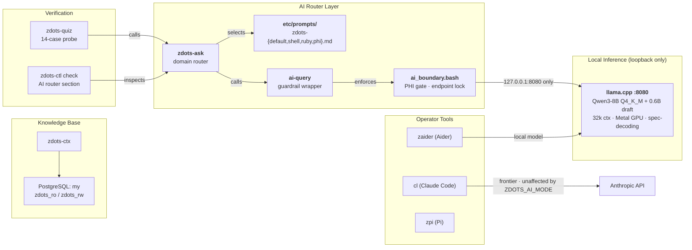
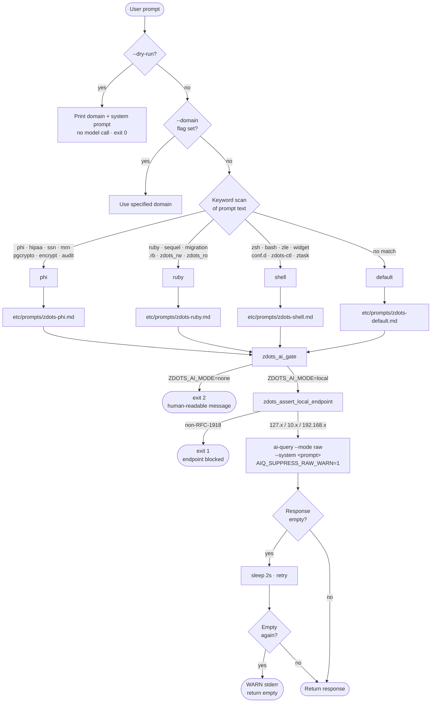
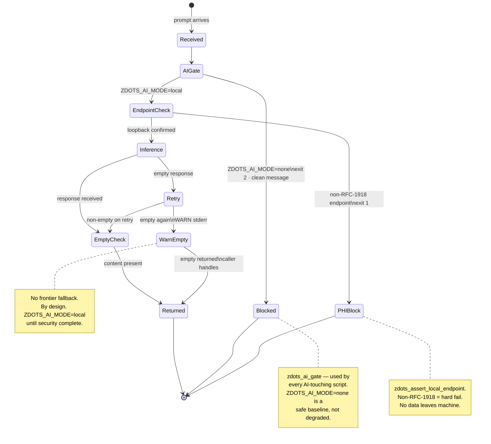
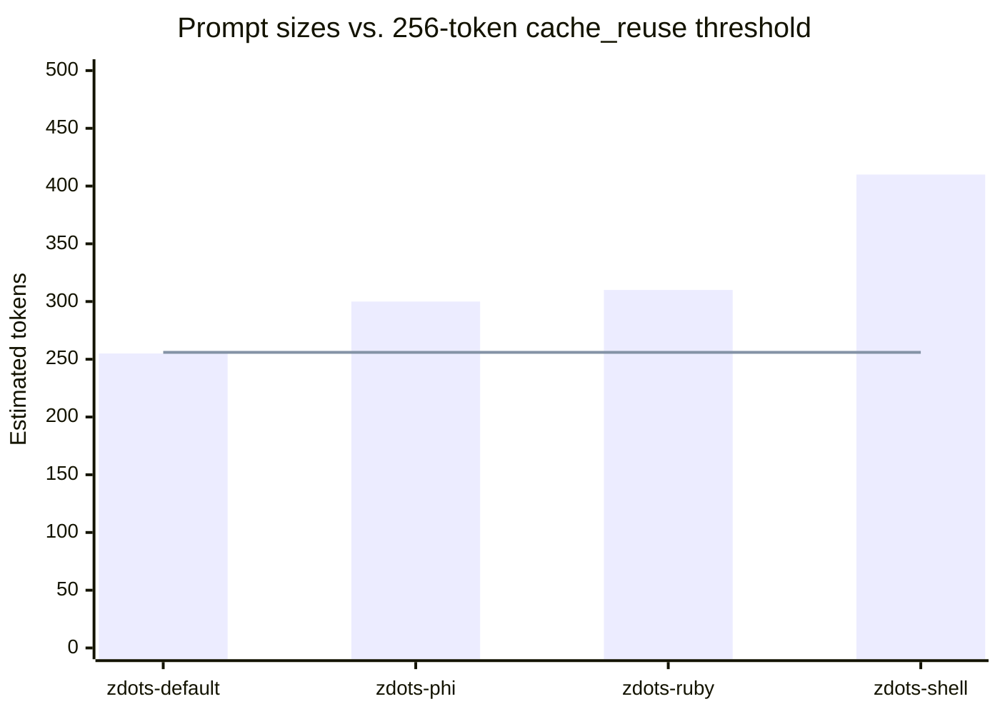
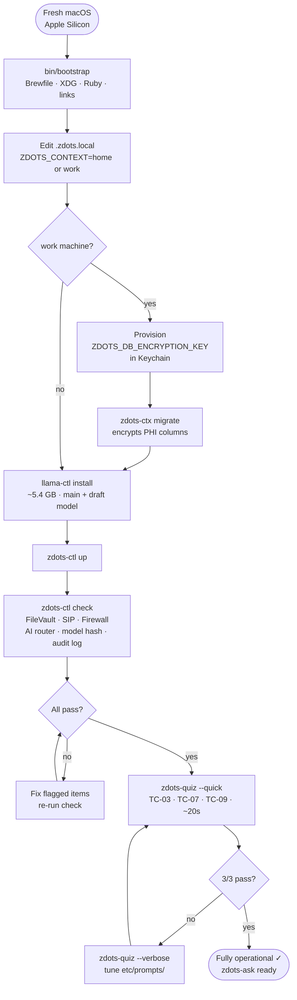
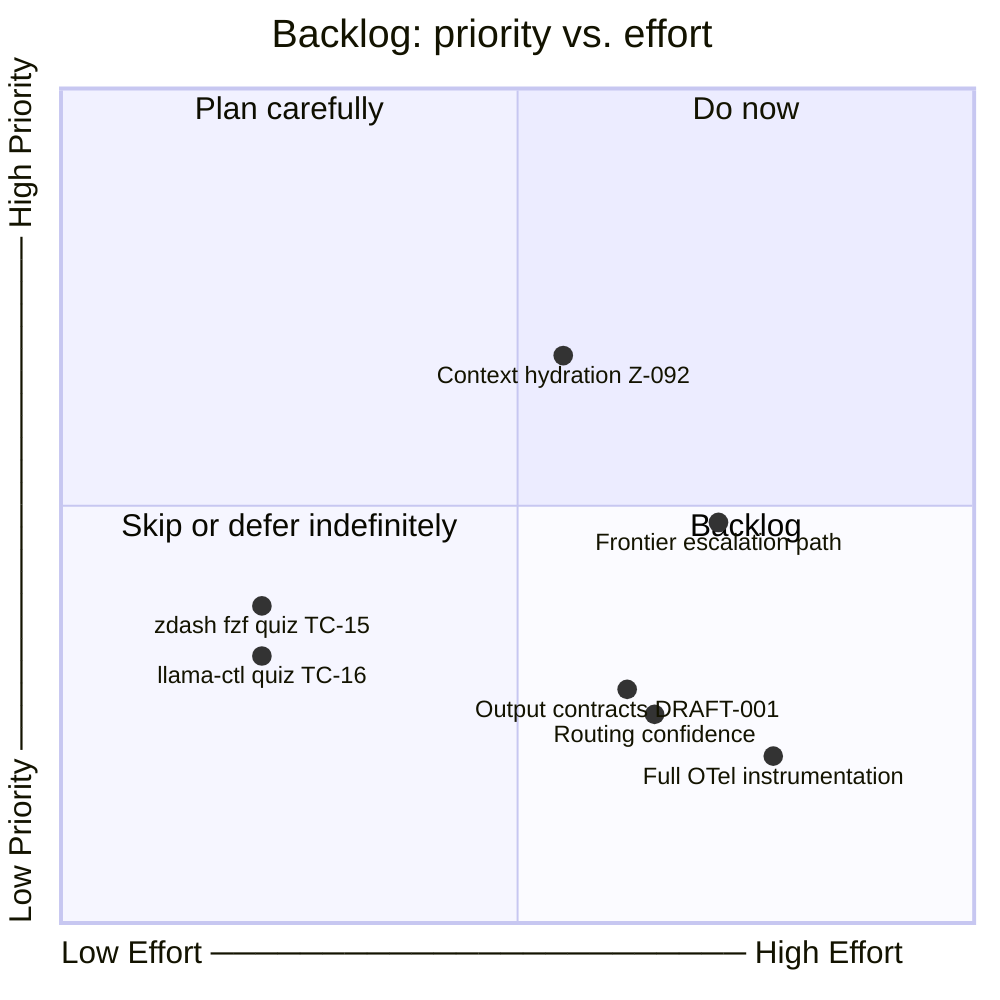

# Local AI Routing Layer

Zdots runs a domain-aware routing layer on top of `ai-query` and llama.cpp. Every prompt is classified by domain, enriched with a compact zdots-specific system prompt, and sent to the local Qwen3-8B model. No cloud egress. No frontier model usage for covered tasks.

> **Mission**: Maximum trusted usefulness from local hardware. Frontier models are the exception, not the default.

---

## 1. System Architecture



---

## 2. Routing Decision Tree

Every `zdots-ask` call follows this path before the model is touched.



---

## 3. Failure Behavior

Zdots has no frontier fallback. `ZDOTS_AI_MODE=local` is enforced at the boundary layer until security setup is complete. Every failure exits cleanly — no hangs, no curl timeouts exposed to callers.



---

## 4. System Prompt Architecture

Four domain prompts in `etc/prompts/`. Each is compact. llama.cpp's built-in prompt cache (enabled by default, 8192 MiB budget) caches the KV prefix after the first call per session; subsequent calls pay near-zero prefill cost. (`--cache-reuse` is not used — it conflicts with speculative decoding.)

All prompts open with the **Caveman Voice** instruction: technical precision, zero filler, code first.



| Prompt | Domain trigger keywords | Load-bearing patterns |
|---|---|---|
| `zdots-default.md` | *(fallback)* | DB roles, tool names, capture constraints, OTel context |
| `zdots-shell.md` | zsh · bash · zle · widget · conf.d · zdots-ctl | ZLE widgets, check helpers, AI call, Keychain, `stat -f`, OTel spans |
| `zdots-ruby.md` | ruby · sequel · migration · .rb · zdots_rw | Migration skeleton, pgcrypto accessors, PHI column list, `rescue Sequel::DatabaseError` |
| `zdots-phi.md` | phi · hipaa · ssn · mrn · pgcrypto · encrypt | 6-layer defense table, PHI script preamble, posture verification |

---

## 5. Capability Delegation Map

```mermaid
quadrantChart
    title What task goes where
    x-axis Deterministic ──────────────────── Requires Judgment
    y-axis Low Stakes ──────────────────────── High Stakes

    quadrant-1 Frontier model only
    quadrant-2 Human review required
    quadrant-3 Unix tools (grep/jq/git/psql)
    quadrant-4 zdots-ask — local LLM

    ZLE widget skeleton: [0.55, 0.22]
    Sequel migration skeleton: [0.58, 0.28]
    PHI boundary pattern: [0.48, 0.18]
    DB role selection: [0.28, 0.12]
    Posture check command: [0.22, 0.08]
    OTel span emission: [0.52, 0.20]
    zdots-ctx capture: [0.48, 0.32]
    Git log search: [0.08, 0.05]
    grep rg fd: [0.05, 0.04]
    jq awk transform: [0.10, 0.08]
    SQL exploration: [0.12, 0.10]
    Multi-file refactor: [0.88, 0.68]
    Architecture decision: [0.92, 0.58]
    Novel problem solving: [0.95, 0.52]
    PHI data handling: [0.72, 0.92]
    Direct code mutation: [0.62, 0.88]
```

**Never route locally:**
- Multi-file architectural decisions
- Novel problems with no prompt coverage (model will hallucinate)
- Anything requiring post-2025 external knowledge
- Direct code mutation without human review (`zaider` handles mutation with git safety)

**Never replace with LLM:**
- `rg` / `fd` / `find` — file search
- `jq` / `awk` — structured data extraction  
- `git log` / `git blame` — history
- `psql -U zdots_ro my` — database exploration

---

## 6. New Machine Verification Sequence



`llama-ctl install` downloads ~5.4 GB (Qwen3-8B Q4_K_M ~5.0 GB + Qwen3-0.6B draft ~0.4 GB). Start it before other setup steps. Use `llama-ctl model-download --draft` to download only the draft model.

---

## 7. Gap Map — Priority vs. Effort



| Task | Priority | Trigger to start |
|---|---|---|
| Z-092 Context hydration | Medium | Stateless answers prove insufficient for "what next?" tasks |
| Z-093 zdash/llama-ctl quiz | Low | Those task types come up in real usage |
| DRAFT-001 Output contracts | Low | Hallucination rate on real tasks exceeds acceptable threshold |

---

## 8. Usage

```bash
# Auto-detect domain from keywords
zdots-ask "explain how ZLE widget saves BUFFER"

# Force domain
zdots-ask --domain ruby "write migration for new column on lessons"

# Inspect routing without inference
zdots-ask --dry-run "is this pattern PHI-safe?"

# Probe model capability
zdots-quiz --quick          # 3 cases, ~20s — run on new machine
zdots-quiz                  # full 14-case baseline
zdots-quiz --verbose        # show model responses for failed cases
zdots-quiz TC-07 --verbose  # single case debug

# Domain list
zdots-ask --list-domains
```
