# Zdots Platform Dependency Graph

> Cross-system view of all components and the **Seams** between them.
> A Seam is where behavior changes without editing in place — callers on one
> side, implementation on the other. These are the right places to intercept,
> test, or swap components.

---

## System Map

```mermaid
flowchart TB
    subgraph Shell["Shell Boot Layer (env.sh → conf.d/)"]
        envsh["env.sh\nPOSIX bootstrap"]
        confd["conf.d/*.zsh\ninterface implementations"]
        envsh --> confd
    end

    subgraph Platform["Platform Service Plane"]
        zdotsctl["zdots-ctl\norchestrator"]
        zsvc["zsvc\nper-service control"]
        zdotsctl --> zsvc
        zsvc --> llamactl["llama-ctl\nAI + embed"]
        zsvc --> otelctl["otel-collector\nhost collector"]
        zsvc --> o2ctl["openobserve-ctl\nobservability backend"]
        zsvc --> whisperctl["whisper-ctl\ntranscription"]
        zsvc --> nginxctl["nginx-ctl\nreverse proxy"]
    end

    subgraph AI["AI Invocation Pipeline"]
        aiinvoke["lib/ai-invoke.bash\nAI Invocation Interface ①"]
        aigate["zdots_ai_gate\nmode gate"]
        msghygiene["zdots_message_hygiene\nnormalize + PHI scrub"]
        aiqlib["lib/ai-query-lib.bash\nHTTP + risk scan"]
        llamaserver["llama-server\n127.0.0.1:11500"]
        aiinvoke --> aigate
        aiinvoke --> msghygiene
        aiinvoke --> aiqlib
        aiqlib --> llamaserver
        llamactl --> llamaserver
    end

    subgraph PHI["PHI Safety Pipeline ②"]
        phiscrubber["lib/phi_scrubber.bash\nPHI Scrubber"]
        aiboundary["lib/ai_boundary.bash\nlocality enforcer"]
        phipatterns["etc/phi-patterns.yaml\npattern registry"]
        phigo["bin/zdots-phi-scrub\nGo binary RE2 engine"]
        phipatterns --> phiscrubber
        phipatterns --> phigo
        msghygiene --> phiscrubber
        phiscrubber --> phigo
        aigate --> aiboundary
    end

    subgraph Knowledge["Knowledge Layer ③"]
        zdotsctx["bin/zdots-ctx\nKnowledge Layer CLI"]
        ctxengine["context-engine\nRails app"]
        pgmy["PostgreSQL 'my'\nzdots_rw / zdots_ro"]
        redis["Redis\nanalytics buffer"]
        zdotsctx --> ctxengine
        ctxengine --> pgmy
        ctxengine --> redis
    end

    subgraph MCP["MCP Transport ④"]
        ctxmcp["bin/ctx-mcp\nMCP stdio server"]
        ctxmcp --> zdotsctx
    end

    subgraph Observability["Observability Pipeline ⑤"]
        otelexport["OTLP export\n(shell spans, AI spans)"]
        otelcollector["otel-collector\nhost agent"]
        openobserve["OpenObserve\nstorage + UI"]
        otelexport --> otelcollector
        otelcollector --> openobserve
        otelctl --> otelcollector
        o2ctl --> openobserve
    end

    subgraph History["History Capture ⑥"]
        phihistory["conf.d/55-phi-history.zsh\ncommand hook"]
        cmdanalytics["conf.d/56-cmd-analytics.zsh\nanalytics + suppress"]
        histsqlite["history.sqlite3\ncommand_runs + shell_hook_metrics"]
        atuin["atuin\nprimary history store"]
        phihistory --> cmdanalytics
        cmdanalytics --> phiscrubber
        cmdanalytics --> histsqlite
        cmdanalytics --> redis
        phihistory --> atuin
    end

    subgraph Intelligence["Intelligence Layer (PLANNED ⑦)"]
        histintel["history-intelligence\nskill — NOT YET BUILT"]
        sessiondebrief["session-debrief\nskill — NOT YET BUILT"]
        histsqlite --> histintel
        atuin --> histintel
        histintel --> sessiondebrief
    end

    subgraph Callers["CLI Entry Points"]
        zdotsask["bin/zdots-ask\ndomain-aware router"]
        aiqbin["bin/ai-query\nscripted inference"]
        zdotsquiz["bin/zdots-quiz\ncapability probe"]
        zaider["zaider\nAider wired to llama"]
        zdash["bin/zdash\ntask runner"]
    end

    %% Shell boot wires everything
    confd --> aiinvoke
    confd --> phihistory
    confd --> cmdanalytics
    confd --> otelexport

    %% Caller → AI Invocation Interface
    zdotsask --> aiinvoke
    aiqbin --> aiqlib
    zdotsquiz --> aiqbin
    zaider --> llamaserver

    %% Agent access via MCP
    agents["AI Agents\n(Claude Code, Pi, Aider)"] --> ctxmcp

    %% Knowledge Layer feeds callers
    zdotsask --> zdotsctx
    zdash --> zdotsctx
```



---

## Seams Index

| # | Seam | File / Component | Callers Cross Here | Implementation |
|---|---|---|---|---|
| ① | **AI Invocation Interface** | `lib/ai-invoke.bash` | `zdots-ask`, `ztask`, `zdots-ctx` distill | `ai-query-lib.bash` → llama-server |
| ② | **PHI Boundary** | `lib/phi_scrubber.bash` + `lib/ai_boundary.bash` | Every AI call, every history hook | `bin/zdots-phi-scrub` (Go/RE2), `etc/phi-patterns.yaml` |
| ③ | **Knowledge Layer** | `bin/zdots-ctx` | Shell scripts, `ctx-mcp`, `ztask done` | `context-engine` (Rails) → PostgreSQL |
| ④ | **MCP Transport** | `bin/ctx-mcp` | AI agents (Claude Code, Gemini, Pi, Aider) | stdio JSON-RPC 2.0 → `zdots-ctx` |
| ⑤ | **Observability Export** | OTLP / `otel-collector` | All shell spans, AI spans, service health | `otel-collector` → OpenObserve |
| ⑥ | **History Capture** | `conf.d/55-phi-history.zsh` | Every interactive command | PHI scrub → SQLite (`command_runs`, `shell_hook_metrics`) + atuin + Redis |
| ⑦ | **Intelligence Layer** | `history-intelligence` skill (PLANNED) | Agent sessions, `zmorning` | `command_runs` + `shell_hook_metrics` + atuin → synthesized report |

> **Note on ⑤:** `otel-collector` plays a dual role — it is both a Platform Service managed by `zsvc`
> and the transport node in the Observability Pipeline. The seam is the OTLP export boundary;
> the service lifecycle is a separate concern.

> **Gap (2026-06-13):** Seam ⑦ does not yet exist. `command_runs` and `shell_hook_metrics` have
> data (1,164 hook metric events; 14+ command runs) but no synthesis layer surfaces it. The
> `history-analyze` tool reads atuin only; it does not read SQLite. This is the next investment.

---

## Component Ownership

| Component | Language | Owner | Notes |
|---|---|---|---|
| `lib/ai-invoke.bash` | Bash | zdots | Seam ① — single call site for inference |
| `lib/ai_boundary.bash` | Bash | zdots | Locality enforcer; exits 1 on non-loopback |
| `lib/phi_scrubber.bash` | Bash | zdots | Shell adapter; delegates to Go binary |
| `bin/zdots-phi-scrub` | Go / RE2 | zdots | Canonical PHI engine — only source of truth |
| `etc/phi-patterns.yaml` | YAML | zdots operator | Only file that may define PHI patterns |
| `bin/zdots-ctx` | Bash | zdots | Seam ③ — Knowledge Layer CLI |
| `context-engine/` | Rails | zdots | PostgreSQL consumer; `zdots_rw` only |
| `bin/ctx-mcp` | Ruby | zdots | Seam ④ — MCP transport |
| `lib/svc-registry.bash` | Bash | zdots | Service metadata store |
| `bin/zsvc` | Bash | zdots | Per-service lifecycle; reads svc-registry |
| `bin/zdots-ctl` | Bash | zdots | Platform orchestration; calls zsvc |
| `conf.d/56-cmd-analytics.zsh` | Zsh | zdots | Suppress-flagged commands dropped here |
| `lib/zdots/manifest.rb` | Ruby | zdots | Dynamic tool registry for MCP |

---

## Data Flow: Agent Query → Knowledge Base

```
Agent (Claude Code)
  │  stdio
  ▼
bin/ctx-mcp  ──────────────────── Seam ④ (MCP)
  │  subprocess
  ▼
bin/zdots-ctx query <term>  ────── Seam ③ (Knowledge Layer)
  │  TCP (Rails API)
  ▼
context-engine (Rails)
  │  pg driver
  ▼
PostgreSQL 'my'  (zdots_rw / zdots_ro)
```

## Data Flow: Shell Command → PHI-Safe Storage

```
zsh preexec hook
  │
conf.d/55-phi-history.zsh
  │
conf.d/56-cmd-analytics.zsh  ─────── suppress check (drop if matched)
  │
lib/phi_scrubber.bash  ────────────── Seam ② (PHI Boundary)
  │  subprocess
bin/zdots-phi-scrub (Go/RE2)
  │
SQLite history.sqlite3 + Redis buffer
```

## Data Flow: zdots-ask → llama-server

```
zdots-ask "prompt"
  │
lib/ai-invoke.bash  ───────────────── Seam ① (AI Invocation Interface)
  ├── zdots_ai_gate  →  exit 2 if ZDOTS_AI_MODE=none
  ├── zdots_message_hygiene  →  normalize + PHI scrub  (Seam ②)
  └── ai-query (subprocess)
        │
        lib/ai-query-lib.bash
          ├── aiq_normalize
          ├── aiq_risk_scan
          ├── aiq_build_prompt
          ├── aiq_submit  →  POST 127.0.0.1:11500  (loopback enforced)
          └── aiq_sanitize_output  →  strip <think>
```

---

## Test Coverage Map

| Seam | Test File | Coverage |
|---|---|---|
| ① AI Invocation | `tests/ai_invoke.bats` | 11 tests — gate, PHI, JSON validation |
| ② PHI Boundary | `tests/phi_boundary.bats`, `tests/phi_scrubber_fuzz.bats` | scrub + suppress |
| ③ Knowledge Layer | `tests/database.bats` | schema, migrations, roles |
| ④ MCP Transport | `tests/mcp.bats` | 30 tests — protocol A-E groups |
| ⑤ Observability | `tests/observability.bats` | OTLP spans, collector health |
| ⑥ History Capture | `tests/cmd_analytics.bats` | suppress, redact, SQLite write |
