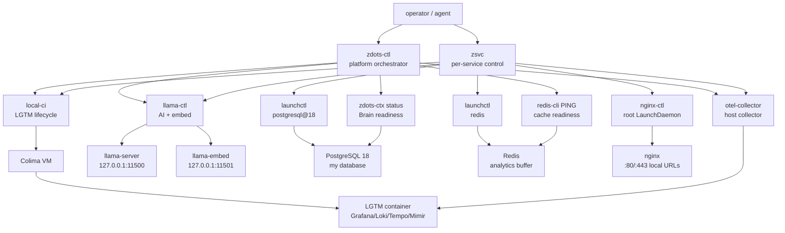
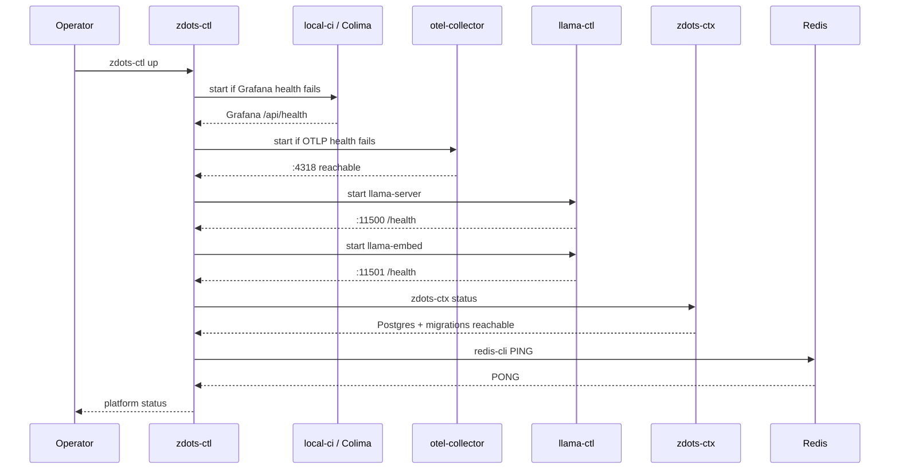
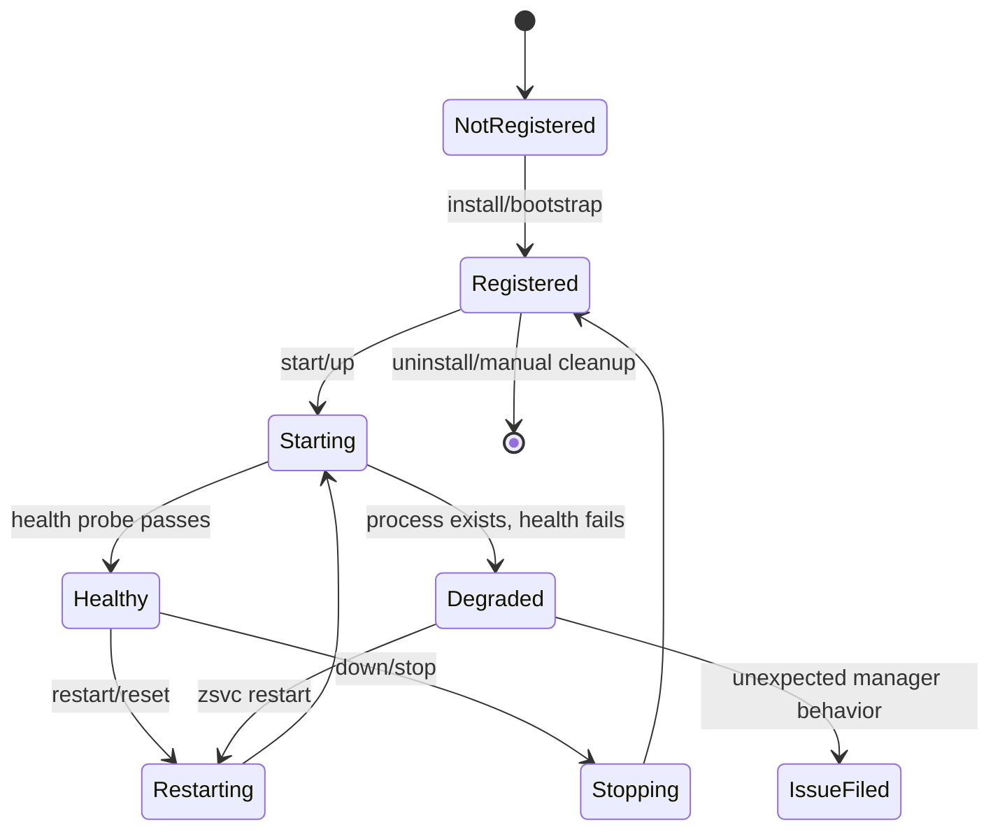
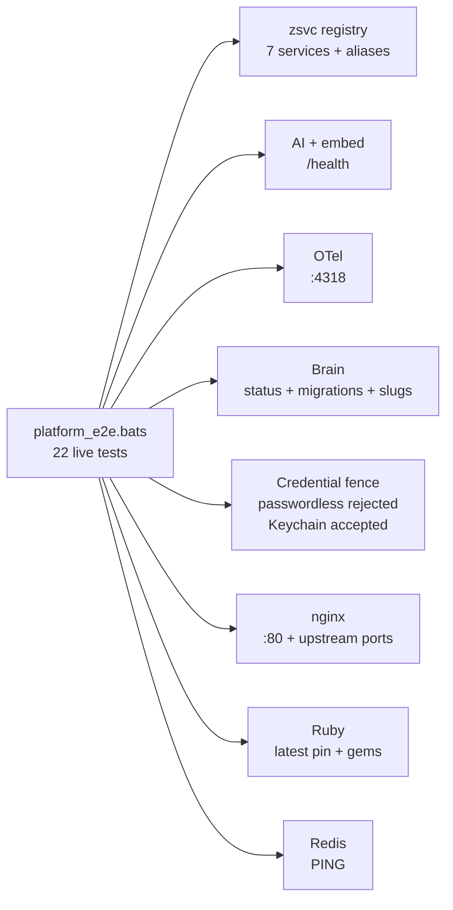

# Platform Service Plane

`zdots-ctl` owns the whole platform lifecycle. `zsvc` owns individual service
lifecycle. `tests/platform_e2e.bats` proves the live service plane is usable.

Use this page when the question is: "Is zdots ready to run?"

## Stable State

Stable means all three layers agree:

| Layer | Command | Stable signal |
|---|---|---|
| Aggregate control | `zdots-ctl status` | all seven service rows are green |
| Service registry | `zsvc list` | all services are registered and running |
| Health probe | `zsvc health` | all services and .local URLs report 'ok' |
| Live E2E | `bats tests/platform_e2e.bats` | `11/11` pass (filtered for services) |

Run live probes outside restricted sandboxes. Sandboxed agents can see false
negatives for loopback TCP, launchctl, Docker, Postgres, and Redis even when the
machine is healthy.

```bash
zdots-ctl status
zsvc list
zsvc health
bats tests/platform_e2e.bats
```

## Service Map



## Startup Lifecycle



## Component Lifecycles

| Component | Manager | Registration | Health | Logs |
|---|---|---|---|---|
| `llama-server` | `llama-ctl` / `zsvc llama` | user LaunchAgent `com.zdots.llama-server` | `GET :11500/health` | `~/.local/state/zsh/llama-server.log` |
| `llama-embed` | `llama-ctl` / `zsvc embed` | user LaunchAgent `com.zdots.llama-embed` | `GET :11501/health` | `~/.local/state/zsh/llama-embed.log` |
| `otel-collector` | `otel-collector` / `zsvc otel` | user LaunchAgent `com.zdots.otel-collector` | OTLP HTTP `:4318` | `~/.local/state/zsh/otel-collector.log` |
| `colima` | `local-ci` / `zsvc colima` | Colima VM state | `colima status` | `colima logs` |
| `nginx` | `nginx-ctl` / `zsvc nginx` | root LaunchDaemon `homebrew.mxcl.nginx` | `:80` listener and host probes | Homebrew nginx logs |
| `postgresql@18` | `zsvc postgres` | user LaunchAgent `homebrew.mxcl.postgresql@18` | `pg_isready` and `zdots-ctx status` | Homebrew Postgres log |
| `redis` | `zsvc redis` | user LaunchAgent `homebrew.mxcl.redis` | `redis-cli PING` | Homebrew Redis log |

## Lifecycle State Machine



## E2E Coverage

`tests/platform_e2e.bats` validates the service plane as a user would depend on
it, not just that processes exist.



| Test group | Proves |
|---|---|
| `zsvc` | services are discoverable, registered, running, and aliasable |
| AI | llama and embed ports answer HTTP health |
| OTel | collector accepts OTLP/HTTP on `:4318` |
| Brain | Postgres credentials, migrations, and captured methods work |
| Credential fence | `zdots_rw` rejects passwordless auth and accepts Keychain auth |
| nginx | local proxy listens and points at `11500` / `11501` |
| Ruby | active Ruby and default gems match the branch contract |

## Isolation Playbook

1. Use aggregate state first:

   ```bash
   zdots-ctl status
   ```

2. If one component is red, perform a deep health probe:

   ```bash
   zsvc health
   zsvc health --json  # for structured detail
   ```

3. Inspect the service registry and diagnosis:

   ```bash
   zsvc list
   zsvc diag <service>
   ```

4. Tail consolidated logs to see failures in real-time:

   ```bash
   zsvc logs all --paths  # list all log files
   zsvc logs all          # tail all logs at once
   ```

5. Restart only the failing component:

   ```bash
   zsvc restart llama
   ```

5. Re-run the live suite:

   ```bash
   bats tests/platform_e2e.bats
   ```

If a documented manager command contradicts its own health contract, file a
`zdots-issue` and stop before changing infrastructure internals.
