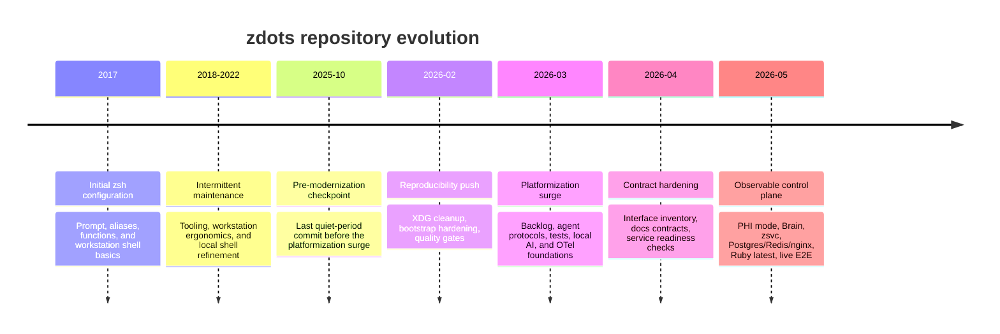
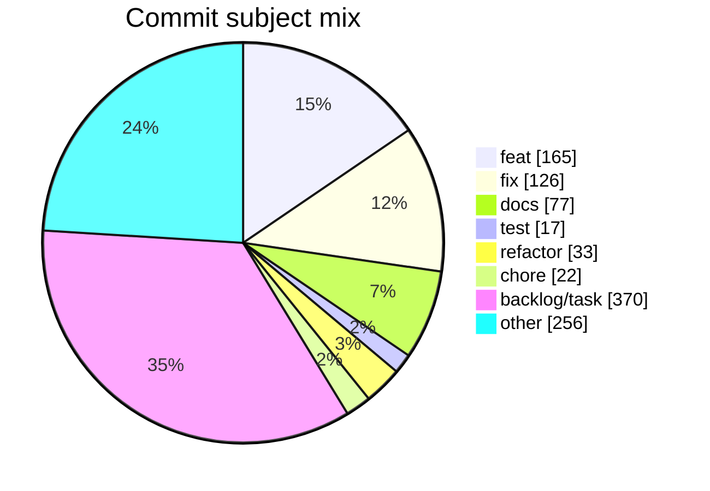
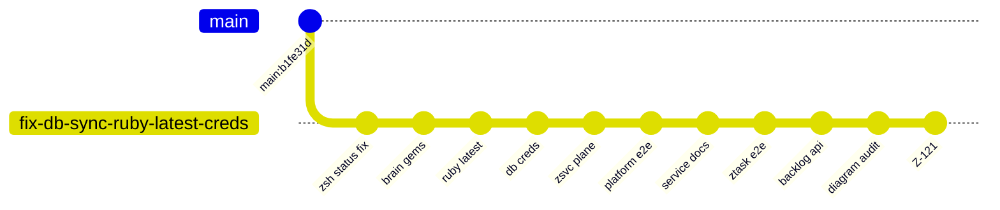
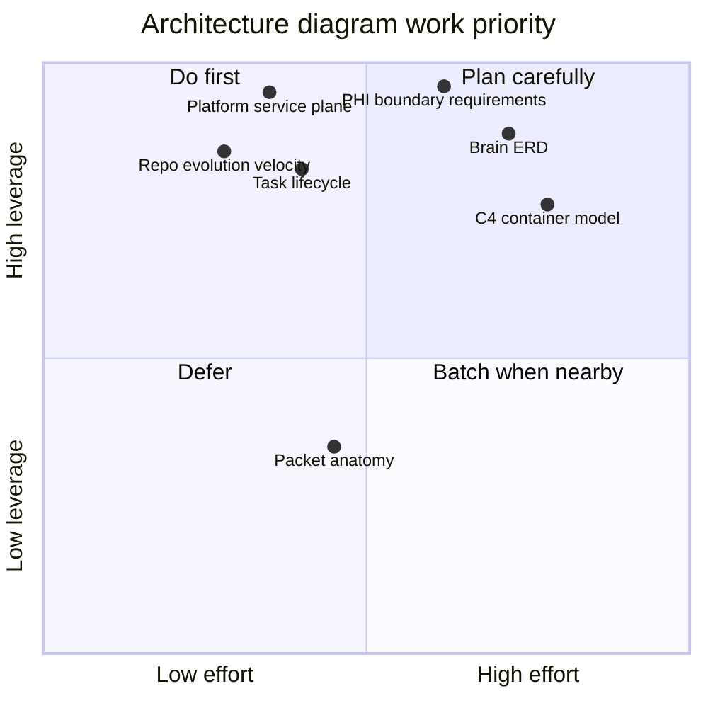
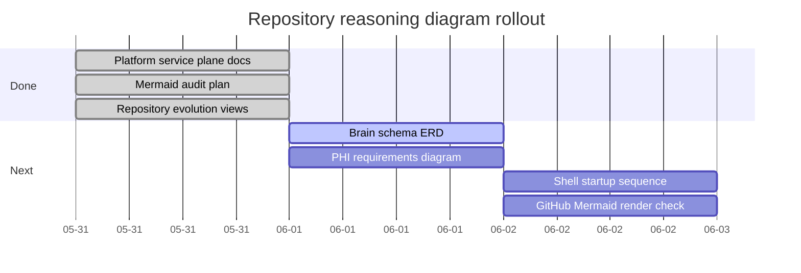

# Repository Evolution

This page turns Git history into durable architecture context. It is a
reasoning aid for humans and AI agents: use it to understand when the repo
changed from a personal zsh config into an observable local platform.

Data provenance:

- Source: `git log --all`
- Measured: 2026-05-31
- Total commits: 1066
- First commit: `2017-05-26 e25021c Setting up Zsh configuration`
- Latest measured commit: `2026-05-31 a819d33 Create task Z-121`

## Evolution Timeline



## Commit Velocity

GitHub's Mermaid renderer supports some beta diagrams inconsistently over time.
The chart below is the primary histogram when it renders; the table is the
stable fallback and the audit source of truth.

```mermaid
xyChart-beta
    title "Monthly commit velocity"
    x-axis ["2017-05", "2017-06", "2017-07", "2017-08", "2018-03", "2018-04", "2018-08", "2018-12", "2019-01", "2020-05", "2021-04", "2021-05", "2021-07", "2021-08", "2021-09", "2021-10", "2021-11", "2021-12", "2022-01", "2022-03", "2022-04", "2022-10", "2022-11", "2025-10", "2026-02", "2026-03", "2026-04", "2026-05"]
    y-axis "Commits" 0 --> 500
    bar [41, 44, 1, 4, 2, 6, 1, 5, 2, 1, 12, 3, 4, 8, 3, 10, 2, 2, 3, 3, 4, 1, 1, 1, 22, 309, 72, 499]
```

| Month | Commits |
|---|---:|
| 2017-05 | 41 |
| 2017-06 | 44 |
| 2017-07 | 1 |
| 2017-08 | 4 |
| 2018-03 | 2 |
| 2018-04 | 6 |
| 2018-08 | 1 |
| 2018-12 | 5 |
| 2019-01 | 2 |
| 2020-05 | 1 |
| 2021-04 | 12 |
| 2021-05 | 3 |
| 2021-07 | 4 |
| 2021-08 | 8 |
| 2021-09 | 3 |
| 2021-10 | 10 |
| 2021-11 | 2 |
| 2021-12 | 2 |
| 2022-01 | 3 |
| 2022-03 | 3 |
| 2022-04 | 4 |
| 2022-10 | 1 |
| 2022-11 | 1 |
| 2025-10 | 1 |
| 2026-02 | 22 |
| 2026-03 | 309 |
| 2026-04 | 72 |
| 2026-05 | 499 |

## Annual Histogram

| Year | Commits | Interpretation |
|---|---:|---|
| 2017 | 90 | Initial shell repository formation |
| 2018 | 14 | Light maintenance |
| 2019 | 2 | Quiet period |
| 2020 | 1 | Quiet period |
| 2021 | 44 | Workstation tooling refresh |
| 2022 | 12 | Low-volume maintenance |
| 2025 | 1 | Pre-modernization checkpoint |
| 2026 | 902 | Control-plane buildout |

## Change Mix

Commit subjects are not perfectly conventional across the full history, so this
pie chart is a directional classification by subject prefix.



The high `backlog/task` count is expected after Backlog became a first-class
coordination layer with auto-committed task mutations.

## Current PR Branch Flow

This branch turns system stability work into a promoted remote-ready platform
slice. It starts at `main` commit `b1fe31d` and is published as PR 3.



## Architecture Work Velocity



## Diagram Execution Timeline



## Regenerate Data

Use compact commands so the result is reviewable:

```bash
git rev-list --count --all
git log --date=format:%Y --format='%ad' --all | sort | uniq -c
git log --date=format:%Y-%m --format='%ad' --all | sort | uniq -c
git log --format='%s' --all | awk '/^feat(\(|:)/{feat++ ; next} /^fix(\(|:)/{fix++ ; next} /^docs(\(|:)/{docs++ ; next} /^test(\(|:)/{test++ ; next} /^refactor(\(|:)/{refactor++ ; next} /^chore(\(|:)/{chore++ ; next} /^backlog:|^Create task|^Update task|^DRAFT-/{backlog++ ; next} {other++} END {print "feat",feat+0; print "fix",fix+0; print "docs",docs+0; print "test",test+0; print "refactor",refactor+0; print "chore",chore+0; print "backlog",backlog+0; print "other",other+0}'
```

