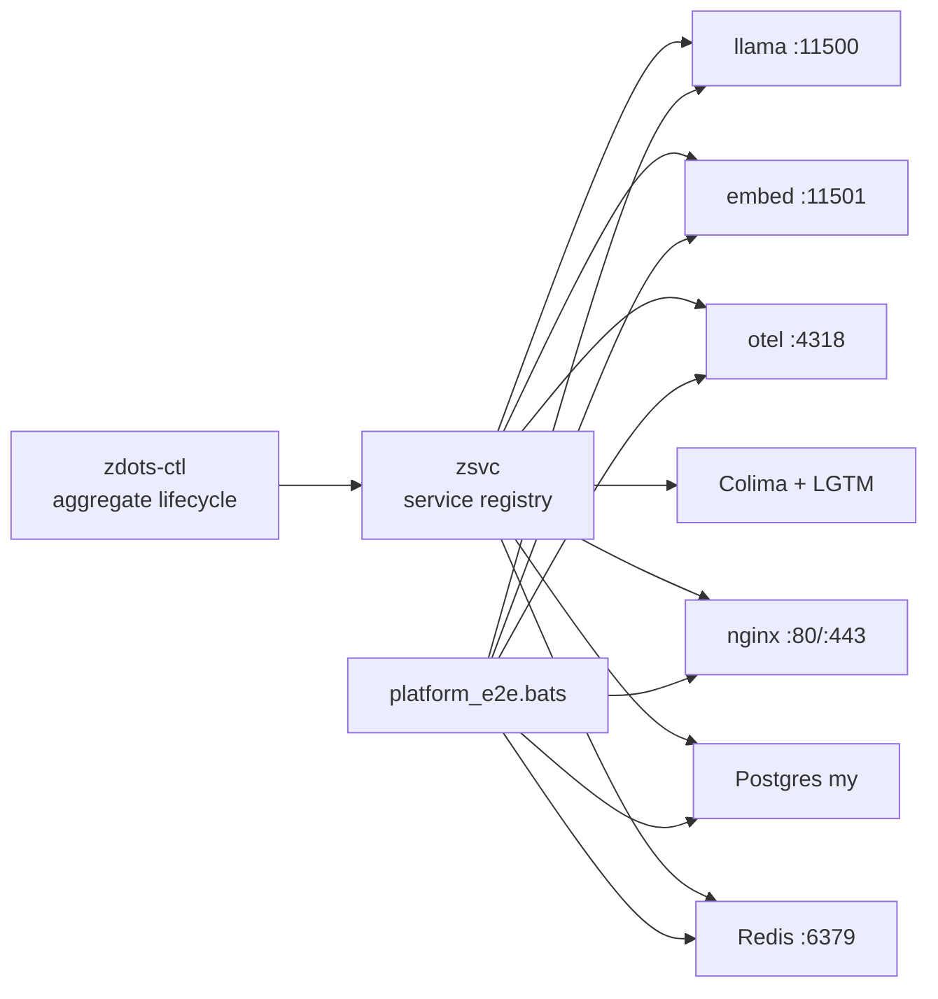

# System Map

Zdots is an observable shell platform with four loops:

1. Shell session emits traces and state.
2. Services expose live status.
3. Knowledge tools capture and hydrate context.
4. Documentation contracts compare live behavior with written interfaces.

## Status Surfaces

| Surface | Meaning |
|---|---|
| `zdots-ctl status --json` | Service uptime and endpoints |
| `capabilities --json` | Environment contract and capability readiness |
| `agent-guide --json` | AI-agent usage map with live probes |
| `zmorning --brief` | Human daily orientation |

These can disagree for valid reasons. Example: `capabilities` can have `health_errors: 0` while services are down because provider contracts are valid even when optional services are stopped.

Status fields must name their source of truth. `ai_server` and `ai_http_healthy` mean the AI `/health` endpoint answered. `ai_socket_listening` only means a process has the loopback port bound. A trace timestamp from `capabilities` is file-derived and should be interpreted with its `last_trace_age_seconds`.

## Platform Service Plane

The live platform is stable only when aggregate control, the service registry,
and live E2E agree:

```bash
zdots-ctl status
zsvc list
bats tests/platform_e2e.bats
```



Full lifecycle and E2E map: [../platform-service-plane.md](../platform-service-plane.md).
